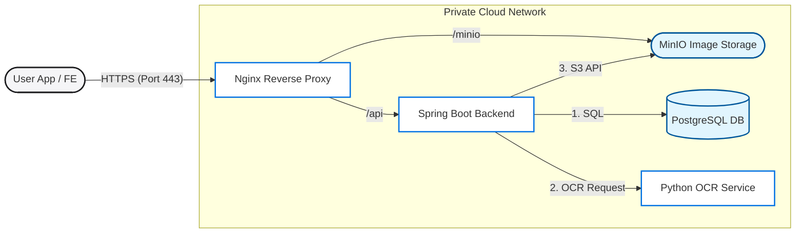
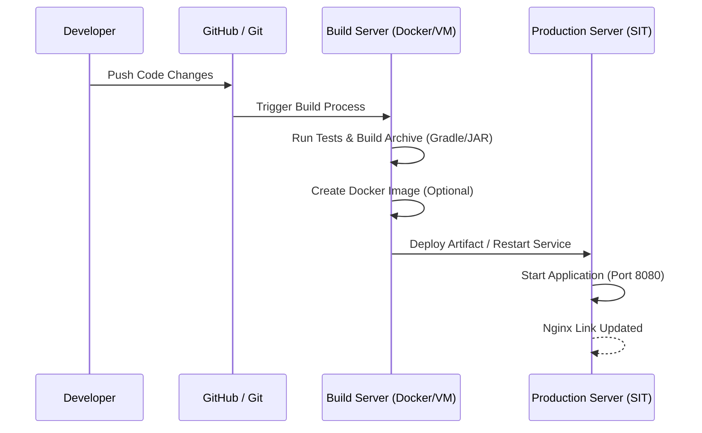

# Finance Care - Infrastructure & Security Guide

This document provides a detailed overview of the infrastructure, security measures, and deployment workflow for the Finance Care project, as required for the capstone presentation.

## 1. Infrastructure Overview (Infra)

The system follows a modern micro-service-oriented architecture with a clear separation between frontend and backend.

| Component | Technology | Description |
| :--- | :--- | :--- |
| **Frontend** | Flutter | Mobile application (Android/iOS) with rich UI and premium design. |
| **Reverse Proxy** | Nginx | Secure entry point for the backend, handling SSL (HTTPS) and traffic routing. |
| **Backend** | Spring Boot (Java) | RESTful API service handling core business logic, authentication, and service orchestration. |
| **Database** | PostgreSQL | Relational database for storing user data, transactions, and debt records. |
| **Storage (MinIO)** | Object Storage | Dedicated service (MinIO) for storing and retrieving user-uploaded images/receipts. |
| **OCR Service** | Python (Tesseract) | Specialized AI service for optical character recognition of receipts. |
| **Cache** | Redis | High-speed caching for session management and performance. |
| **Hosting** | SIT KMUTT Infrastructure | Hosted on the university's private cloud network (`10.4.x.x`). |

### Network Topology

## 2. Secure Connection

All communication between the mobile app and the backend is secured using **HTTPS (HyperText Transfer Protocol Secure)**.

-   **Encryption**: Data is encrypted in transit using **TLS (Transport Layer Security)**, ensuring that sensitive information (passwords, income data) cannot be intercepted by third parties.
-   **Endpoint Protection**: The backend is hidden behind an Nginx reverse proxy, which serves as the SSL termination point. This follows security best practices by not exposing the application server directly to the internet.
-   **Fixed Protocol**: The project has been standardized to use `https://bscit.sit.kmutt.ac.th/...` to avoid insecure HTTP redirects (301 Moved Permanently errors).

## 3. Deployment Workflow Diagram

The deployment process follows a systematic flow from development to production.

### Deployment Explanation
-   **Build**: We use **Gradle** to build the Spring Boot project into an executable JAR file.
-   **Environment**: The backend runs in a Linux-based environment (or Docker container) within the SIT infrastructure.
-   **Routing**: Nginx is configured to route traffic from the public URL to the specific port (`8080`) where the backend is listening.

## 4. Security Scan (OWASP ZAP)

To ensure the system is resilient against common web vulnerabilities, we use **OWASP ZAP (Zed Attack Proxy)**.

### How to Scan
1.  **Initial Scan**: Run an "Automated Scan" on the backend URL: `https://bscit.sit.kmutt.ac.th/capstone25/cp25ms2/api/`.
2.  **Spidering**: ZAP will crawl the API endpoints to discover accessible paths.
3.  **Active Scan**: ZAP will simulate various attacks (SQL Injection, Cross-Site Scripting, etc.).

### Key Security Findings to Report:
-   **Absence of Anti-CSRF Tokens**: Check if API requests need CSRF protection (mostly for session-based auth).
-   **Cookie Security**: Ensure cookies are flagged as `HttpOnly` and `Secure`.
-   **Header Protection**: Verify security headers like `X-Frame-Options: DENY` (already implemented as seen in logs).
